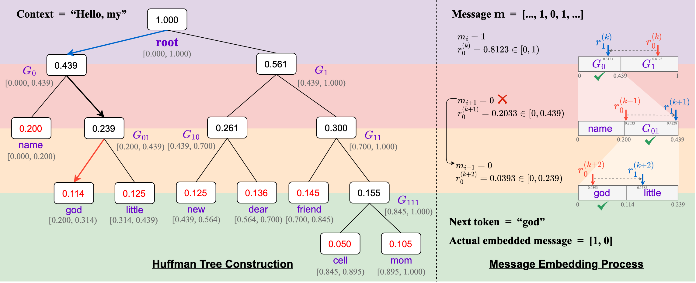

# Discop

Discop: Provably Secure Steganography in Practice Based on “Distribution Copies”

[Jinyang Ding](https://dingjinyang.github.io/), [Kejiang Chen](http://home.ustc.edu.cn/~chenkj/), [Yaofei Wang](http://faculty.hfut.edu.cn/yaofeiwang/en/index.htm), Na Zhao, [Weiming Zhang](http://staff.ustc.edu.cn/~zhangwm/), and [Nenghai Yu](http://staff.ustc.edu.cn/~ynh/)

In [IEEE Symposium on Security and Privacy (IEEE S&P) 2023](https://sp2023.ieee-security.org/)

[[PDF]](https://dingjinyang.github.io/uploads/Discop_sp23_paper.pdf) [[Cite]](#citation) [[Slides]](https://dingjinyang.github.io/uploads/Discop_sp23_slides.pdf) [[DOI]](https://doi.org/10.1109/SP46215.2023.10179287) [[Blog Post (in Chinese)]](https://comydream.github.io/2023/06/07/discop-sp23/)

## Brief Overview

Given a probability distribution to sample from, if we want to embed $n$ bits, we construct $2^{n}$ copies of the distribution by rotation and use the copy index to express information.


To improve the embedding rate, we decompose the multi-variate distribution into multiple bi-variate distributions through a Huffman tree.



The embedding rate can reach about 0.95 of its theoretical limit.

## Usage

### Preparation

First, please ensure that you have installed all the required libraries for this repository.

We recommend using [Anaconda](https://anaconda.org/anaconda/conda) and execute the following commands.

```shell
conda create -n discop python=3.8.12
conda activate discop

# Visit the PyTorch website (https://pytorch.org/get-started/locally/) for installation commands tailored to your environment
# We have not tested PyTorch versions other than v1.12.0.
conda install pytorch==1.12.0 torchvision==0.13.0 torchaudio==0.12.0 cudatoolkit=11.3 -c pytorch
# Install other dependencies
python -m pip install -r requirements.txt

# Build the Cython files
python src/setup.py build_ext --build-lib=src/
```

### Run Single Example

You can modify the default settings for each generation task in `src/config.py`.

The program may automatically download the required pretrained models and datasets during the first run.

```shell
python src/run_single_example.py
```

### Get Statistics

```shell
python src/get_statistics.py
```

## Acknowledgment

In the text generation and image completion tasks, we directly employ the pre-trained models provided by [Hugging Face](https://huggingface.co/models).

In the text-to-speech (TTS) task, we utilize publicly available pre-trained models from [bshall/Tacotron](https://github.com/bshall/Tacotron/tree/main/tacotron) and [bshall/UniversalVocoding](https://github.com/bshall/UniversalVocoding).
We have incorporated them into our code repository (`src/tacotron/` and `src/univoc/`) and made some adaptations as needed.

- Add `src/tacotron/TTS_cleaner.py`, which borrows from [Coqui.ai TTS](https://github.com/coqui-ai/TTS/blob/main/TTS/tts/utils/text/cleaners.py).
- Add the `encode_speech()`, `decode_speech()`, and `random_sample_speech()` functions in `src/univoc/model.py` to facilitate Discop’s message embedding and extraction, as well as random sampling.

## Citation

If you find this work useful, please consider citing:

```
@inproceedings{dingDiscopProvablySecure2023a,
  title      = {Discop: {{Provably Secure Steganography}} in {{Practice Based}} on ``{{Distribution Copies}}''},
  shorttitle = {Discop},
  booktitle  = {2023 {{IEEE Symposium}} on {{Security}} and {{Privacy}} ({{SP}})},
  author     = {Ding, Jinyang and Chen, Kejiang and Wang, Yaofei and Zhao, Na and Zhang, Weiming and Yu, Nenghai},
  year       = {2023},
  month      = may,
  pages      = {2238--2255},
  publisher  = {{IEEE Computer Society}},
  address    = {Los Alamitos, CA, USA},
  doi        = {10.1109/SP46215.2023.10179287},
  url        = {https://ieeexplore.ieee.org/document/10179287},
  isbn       = {978-1-66549-336-9},
  langid     = {english}
}
```
